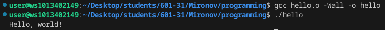
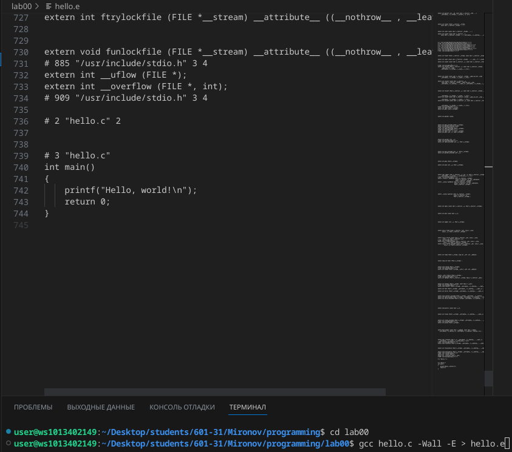
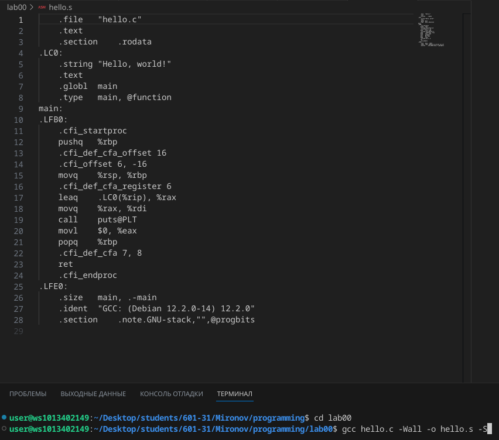
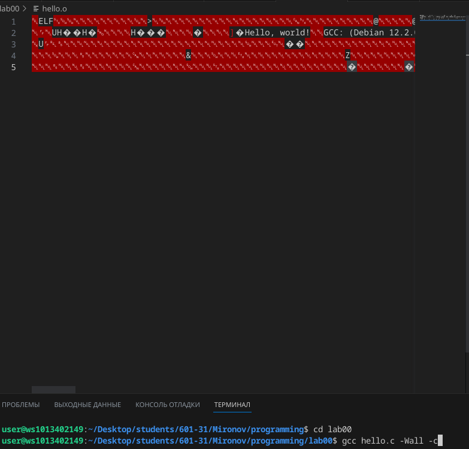
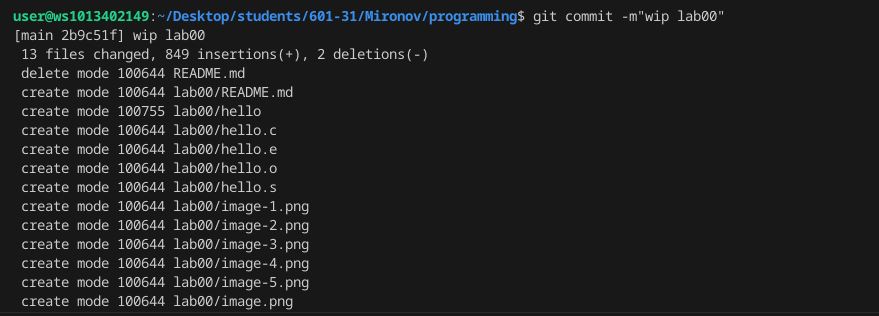
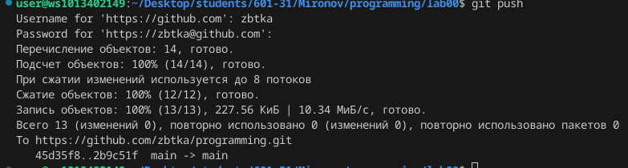

# programming
Prog Labs
# Лабораторная работа №0

## Oтчёт в Markdown по примеру
#Задания для самостоятельного выполнения

## Сложность: Rare

1.Создайте репозиторий для дисциплины на GitHub.

2.Склонируйте его себе на ПК.

3.Напишите свою первую программу.

4.Скомпилируйте и запустите её.

5.Получите по отдельности результаты каждого этапа компиляции.

6.Напишите отчёт в README.md. Отчёт должен содержать:

* Задание

    * Описание проделанной работы

    * Консольные команды

    * Скриншоты результатов

    * Ссылки на используемые материалы
    
7.Сделайте коммит и пуш.

8.Добавьте для себя в отчёт шпаргалку по работе с git.

# Ход работы

## Создайте репозиторий для дисциплины на GitHub: https://github.com/zbtka/programming

## Склонируйте его себе на ПК.
### git clone:
https://github.com/zbtka/programming/tree/main/lab00

## Напишите свою первую программу.
```c
#include <stdio.h>

int main()
{
    printf("Hello, world!\n");
    return 0;
}
```
## Скомпилируйте и запустите её.


## Препроцессор

## Компилятор



## Объектные файлы




## Сделайте Комит и пуш



## Шпоргалка по работе с Git:


git add .

git commit -m"wap lab00"

git push

## Список используемых источников
* https://github.com/still-coding/report_demo/blob/main/README.md
* https://doka.guide/tools/markdown/


